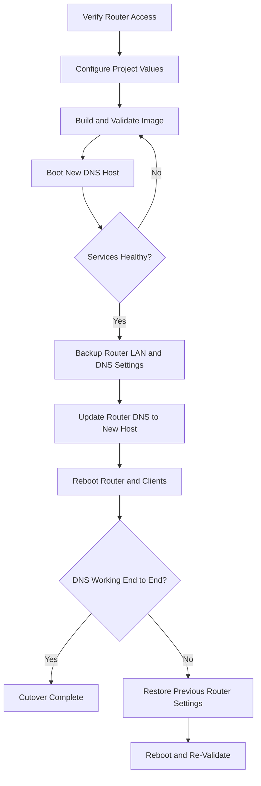

# ke-net-screen

Raspberry Pi 5 Image Builder for Home DNS

**NOTICE:** These instructions eventually affect your network configuration and connections. You are responsible. You may need to reset or reboot your Internet Service Provider (ISP) modem or contact ISP support to regain proper access if all goes wrong. While fixable, a certain level of patience and required planning are necessary to properly reconfigure your network. This repository was made simple over the course of multiple weekends of network up-and-down exercises.

Success will be determined through validation and testing. Your user experiences may change. You may need to learn new habits of clicking and browsing to mitigate blocked connections. Search results for example may need further scanning to get to a direct link instead of one parlayed through an advertiser!

If this project saves you time or helps your network setup, you can support ongoing maintenance through the GitHub Sponsors button for this repository.

You must review assigned values in defaults before building or deploying the resulting image. While efforts have been made to provide generic and friendly defaults, these defaults may not work in your network environment.

## Workflow

Use this sequence to reduce outage risk during deployment:

1. Prepare and validate
   - Confirm ISP modem/router admin access and credentials.
   - Build and verify locally before changing network settings.
   - Update project settings in config/ and .env for your target network.

2. Create and boot target image
   - Build image artifacts and write the SD card.
   - Boot the new DNS host and verify services are healthy.

3. Cut over router settings
   - Back up current LAN/DHCP/DNS settings on the router first.
   - Set router DNS to the new host IP.
   - Disable router DHCP. In this project design, DHCP is served by the Pi-hole configuration on the new DNS host.
   - Do not run router DHCP and Pi-hole DHCP at the same time. Dual DHCP servers can issue conflicting leases, gateways, and DNS settings, causing intermittent connectivity and name resolution failures.

4. Reboot and confirm client registration
   - Reboot router and selected clients in a stable order.
   - Re-check DNS on clients and verify expected filtering behavior.

5. Roll back quickly if needed
   - Restore saved router DNS/LAN settings.
   - Reboot router and clients to re-register leases/resolvers.



**Be ready to use a wired connection to your ISP modem/router during cutover and rollback.**

## Description

AdBlock and Privacy Stripped Recursive DNS Resolver image builder using rpi-image-gen, pi-hole, unbound. Additional configuration of Avahi-daemon for local services discovery such as screen cast, printers, other '.local' services.

**Repository:** devopsbob/ke-net-screen
**Purpose:** Custom Raspberry Pi image builder combining rpi-image-gen with Pi-hole, Unbound, and Avahi-daemon for a local DNS and media server.

The MIT license in this repository applies to the original ke-net-screen code and documentation; bundled submodules and other third-party components remain under their own licenses.

### Third-Party Components

- `rpi-image-gen`: Included as a git submodule and licensed separately by Raspberry Pi. See `rpi-image-gen/LICENSE`.
- `pi-hole`: Included as a git submodule under `vendors/pi-hole` and licensed separately by Pi-hole, LLC. See `vendors/pi-hole/LICENSE`.
- `unbound`: Referenced as a git submodule in `.gitmodules` and licensed separately by NLnet Labs. See the upstream `NLnetLabs/unbound` repository license when that submodule is initialized locally.

## Table of Contents

- [Workflow](#workflow)
- [Description](#description)
- [Overview](#overview)
- [Hardware Requirements](#hardware-requirements)
- [Quick Start](#quick-start)
- [Initial Setup](#initial-setup)

## Overview

### Project Goals

- Create reproducible Raspberry Pi 5 images with Pi-hole and Unbound
- Implement DNS hardening and privacy features
- Configure systemd-resolved networking
- Enable mDNS via Avahi for local service discovery
- Provide comprehensive verification procedures

### Network Configuration

- Primary DNS: 127.0.0.1 (Pi-hole on port 53)
- Upstream DNS: Unbound on port 5335 resolving to public DNS
- Network Management: systemd-resolved
- Service Discovery: Avahi mDNS

### Access Points

- Router: <http://your-router-internal-ip/router.html>
- Development Host: <http://your-on-network-client-machine/>
- Target Server Lookup: <http://your-router-internal-ip/admin/settings/dhcp>
- Target Server: <http://your-router-dhcp-reporting-assigned-ip-of-new-host/admin/>
- SSH: `C:\Windows\System32\OpenSSH\ssh.exe localadmin@your.internal.ip.address`

The access points will be used during the build and deployment. At this point you need to know your current internal router IP and admin login credentials. The development host is likely your desktop computer. The target server lookup is when you find the new IP address for your newly plugged in Raspberry PI. Target server is the Raspberry PI machine where you will host and build this repository. This setup will assign the final Raspberry PI image a static IP address so it can be used as primary DNS server for your router and home network.

## Hardware Requirements

### Required Components

1. Raspberry Pi 5 Starter Kit
2. USB 3.0 64GB USB stick (build host)
3. MicroSD card (target deployment, comes with kit)
4. USB keyboard and mouse
5. Monitor with HDMI cable
6. Ethernet cable (required, not WiFi)

## Quick Start

For experienced users who have the prerequisites:

```bash
cd ke-net-screen
cp .env.example .env
# edit .env and set a strong PIHOLE_PASSWORD value
./ke-net-screen.sh --preflight
./ke-net-screen.sh
# Insert SD card when prompted
# SD card gets erased!!
# Wait 15-20 minutes for build completion
# Image is copied onto SD card
sudo shutdown now
# Remove USB, reboot, it will run from the SD card
```

### Preflight and Build-Only Modes

Use preflight mode to validate host prerequisites before any destructive actions:

```bash
./ke-net-screen.sh --preflight
```

Use build-only mode to generate artifacts without writing to SD card:

```bash
./ke-net-screen.sh --build-only
```

Build-only output is written under the generated build directory (for example: `ke-net-screen-build/`).
If you run the default mode and provide a missing/nonexistent device path, the script automatically falls back to build-only and skips flashing.
The `PIHOLE_PASSWORD` value is embedded into a one-time secret file on the boot partition during image build, applied on first boot, and then deleted by the first-boot setup script.

### Source-Built Unbound Mode

By default, the image uses package-managed Unbound behavior.

Layer wiring for source-mode support is controlled in `layer/ke-00-layer.yaml` under `X-Env-Layer-Requires`.

Current default includes `ke-unbsrccfg`:

```text
# X-Env-Layer-Requires: systemd-net-min,ke-unbsrccfg,ke-unbcfg,ke-piholecfg,ke-avhicfg
```

To disable source-artifact install behavior, remove `ke-unbsrccfg` from the list:

```text
# X-Env-Layer-Requires: systemd-net-min,ke-unbcfg,ke-piholecfg,ke-avhicfg
```

To re-enable it later, add `ke-unbsrccfg` back into `X-Env-Layer-Requires`.
When present, the `ke-unbsrccfg` layer installs staged source-built Unbound artifacts when available and safely falls back to package-managed Unbound when artifacts are not present.

Enable source-built Unbound explicitly:

```bash
./ke-net-screen.sh --source-unbound
```

Build-only variant:

```bash
./ke-net-screen.sh --source-unbound --build-only
```

Optional: validate your runtime Unbound config against the staged source binary during build:

```bash
./scripts/build-unbound.sh ./ke-net-screen-build --with-pihole-conf-check
```

#### APT package cache (faster repeat builds)

Pass `--apt-cache` to enable a host-side APT package cache. The cache lives in
`apt-cache/` in the project directory (excluded from git, like the source-Unbound
build directory) and is handed to rpi-image-gen via `IGconf_sys_apt_cachedir`:

```bash
./ke-net-screen.sh --source-unbound --apt-cache --build-only
```

The first run populates the cache; subsequent runs retrieve packages from it when
the repository metadata allows. You will still see `I: running apt-get update...`,
but `I: downloading packages with apt...` should pass quickly or be skipped.

If a cache already exists when you start an **interactive** run with `--apt-cache`,
the script prompts before building:

- `[K] Keep` — reuse the existing cache (default; also used for non-interactive runs).
- `[R] Refresh` — empty the cache, then repopulate it during this build.
- `[D] Delete` — remove the cache directory and build without a cache this run.

> Requires an rpi-image-gen that supports `IGconf_sys_apt_cachedir` (the
> `sys: implement apt package cache` change in the `rpi-image-gen` submodule).

#### Success Criteria

When source mode is enabled, all of the following should be true:

1. Build log shows source mode execution:
   - `[unbound-source] Building Unbound from source before image assembly...`
2. Build log confirms rootfs inclusion:
   - `[unbound-source] Verified: source-built unbound present in rootfs ...`
3. Rootfs contains source-built binaries and library:

```bash
./scripts/check-unbound-build.sh ./ke-net-screen-build
```

Expected checker summary:

- `RESULT: ... 0 failed ...`

#### Fallback Behavior Meaning

Layer `ke-unbsrccfg` installs source-built artifacts only when they exist under build staging.
If artifacts are absent, it logs an informational fallback and leaves package-managed Unbound in place.

Fallback message:

- `INFO: ke-unbsrccfg: no source-built Unbound artifacts detected ...; falling back to package-managed unbound`

This fallback is intentional for safe default behavior and non-source builds.

#### Troubleshooting

1. Source build did not run.
   - Confirm you passed `--source-unbound`.
   - Confirm submodule exists: `git submodule status vendors/unbound`.

2. Source artifacts not discovered by layer.
   - Verify staged binary path exists:
     - `ke-net-screen-build/build/staging/<gnu-type>/usr/sbin/unbound`
   - Re-run source build:
     - `./scripts/build-unbound.sh ./ke-net-screen-build`

3. Config/module mismatch during staged config validation.
   - Re-run with config check:
     - `./scripts/build-unbound.sh ./ke-net-screen-build --with-pihole-conf-check`
   - If `unbound-checkconf` fails, adjust `etc/unbound/unbound.conf.d/pi-hole.conf` or build options.

4. Rootfs validation fails after source mode build.
   - Re-run:
     - `./scripts/check-unbound-build.sh ./ke-net-screen-build`
   - Inspect `ke-unbsrccfg` hook output in build logs for copy-stage messages.

### Post-Boot Acceptance Checks

After first boot, validate service readiness:

```bash
sudo systemctl status pihole-FTL unbound avahi-daemon systemd-resolved
sudo systemctl status dns-health-check.timer
sudo journalctl -u dns-health-check.service -n 100 --no-pager
dig @127.0.0.1 github.com
```

## Initial Setup

### 1. Boot Initialization

1. Assemble Raspberry Pi hardware
2. Connect keyboard, mouse, and monitor
3. **Do NOT** insert microSD card
4. **Do** insert USB 3.0 64GB stick
5. Connect Ethernet cable
6. Hold Shift key and power on

This triggers NetBoot to install base OS via internet to USB stick.

We use `localadmin` as the default user with a password of our choosing. The `root` user will also exist and should be given a different password. Be sure to write down the passwords!

### 2. Initial System Upgrade

```bash
sudo apt update && sudo apt upgrade
```

#### Optional RPI-UPDATE

`rpi-update` provides newer kernels than stable APT repository. Mixing kernels during an image build process assumes risk to any incompatibilities between kernels. If this is your first time, you can skip this step.

```bash
sudo rpi-update
sudo reboot
sudo apt update && sudo apt upgrade
```

### 3. Development Environment Setup

Here we describe how the project was built and configured so that you may have greater success to build your own deployed server image.

#### VSCode Remote SSH

This repository is intended to be hosted on the target hardware for the resulting image - a RaspberryPi5 single-board-computer. Experience has shown that running WSL, Windows Subsystem Linux, does not allow running various root file system creation tools. Security measures are likely due to nested-hosting and virtualization risk vectors. You may read and trial these step on any machine but they are only proven to work on a RaspberryPI5 host accessed via SSH thru VSCode.

1. Go to VSCode extensions
2. Install **Remote Development Extension**
   1. ms-vscode-remote.vscode-remote-extensionpack
3. Go to the Raspberry PI machine
   1. Execute `sudo raspi-config`
   2. Select Interface Options > SSH
   3. Enable SSH Server
4. Go to VSCode
   1. CTL-SHIFT-P for Extension action
   2. Remote-SSH: Connect Current Window to Host
   3. Configure new host, use `username@ip.address` (<localadmin@192.xx.xx.xx>)
   4. Connect and authenticate using username password
5. Clone and manage repository on remote host

Verify connectivity to the remote SSH host. You may also execute these steps directly on the host in the Debian desktop on the RaspberryPI. Be aware that the final RaspberryPi image created by this repository is not GUI or Desktop enabled. It is purely a DNS server.

#### Local Development

On the remote SSH host clone this repository. Update or reconfigure the submodules to align to your repository needs.

```bash
mkdir -p ~/source/github && cd ~/source/github
git clone https://github.com/devopsbob/ke-net-screen.git
cd ke-net-screen
```

The `.gitmodules` file contains reference to the actual builder executables required. This repository provides a layering template example to enable a small lab or home network DNS server. Change the URL to match your fork repository or keep main rpi-image-gen repository.

```bash
# .gitmodules
[submodule "rpi-image-gen"]
 path = rpi-image-gen
 url = https://github.com/raspberrypi/rpi-image-gen
[submodule "vendors/pi-hole"]
 path = vendors/pi-hole
 url = https://github.com/pi-hole/pi-hole.git
```

Make the submodule code available to the current repository:

```bash
git submodule init
git submodule update
cd rpi-image-gen
sudo ./install_deps.sh
```

##### Option A: RPI-IMAGE-GEN Submodule

The rpi-image-gen repository is its own source of truth. Any modifications or changes to the repository are bound by the maintainer(s). To respect and honor this to allow variations that can be easily contributed back to the maintainers, a targeted or forked repository configuration can be used private use.

1. Using Github credentials, fork the rpi-image-gen repository
   1. This allows for localized changes with ability to inherit upstream changes; don't forget to update your fork!
2. In your local repository add the forked repository as a submodule
   1. The local repository is created as private.
   2. The forked repository is public.
   3. The submodule treats the rpi-image-gen tool and software as an external dependency.

```bash
# Delete the current submodule setup and configuration
# rm -Rf .gitsubmodules rpi-image-gen

# Add a submodule
# git submodule add <remote_url> <destination_folder>

# Add the "rpi-image-gen" forked repository as a submodule in the project root folder
git submodule add https://github.com/your-github-id/rpi-image-gen.git rpi-image-gen
```

#### Initializing and Updating Submodules

When you clone a repository that contains submodules, the submodule directories will be present but empty. To initialize and update the submodules, run the following commands:

##### Initialize the submodule configuration

git submodule init

##### Update the submodules to fetch the data and check out the appropriate commit

git submodule update

Alternatively, you can use the --recurse-submodules option with the git clone command to automatically initialize and update the submodules during the cloning process:

##### Clone the repository and initialize and update submodules

git clone --recurse-submodules <repository_url>

##### Updating Submodules

To update an existing submodule to the latest commit from the remote repository, use the git submodule update command with the --remote and --merge options:

##### Update the submodule to the latest commit and merge changes

git submodule update --remote --merge

### 4. Configure

Before you build and test you will need to do a bit of detective work to identify your current network configuration.

#### Current Router Network Information

This is your connection to the internet. It is your 'gateway' modem. If you cannot get to or access this information you need to go to your ISP support or stop here. You may continue to review and build the image anyhow but you will not be able to reconfigure DNS for your entire home default DNS network without this access.

Below is simply an example. Your network may be 192.168.1, 10.x, or 172.x. These are all considered "private" networks. If you see other numbers, aka 68.x, 69.x, then you are looking at the WAN configuration and not the LAN configuration.

1. Navigate to Modem/Router Host
   `http://192.168.0.1/admin`

2. Login
   - username: admin
   - password: default is printed on label, otherwise recorded elsewhere

3. Navigate to LAN Setup > LAN Settings
   - DHCP Server Settings
      - Checked on/Enabled
      - Start IP: 192.168.0.2
      - End IP  : 192.168.0.254
      - Domain Name: empty
      - This will be turned OFF once the DNS Host is in place
   - DNS Override
      - Enable DNS Override
         - Uncheck/clear. No custom DNS configuration
      - Current Assigned examples:
         - DNS: 8.8.8.8 9.9.9.9

You need to know your ISP default DNS. You are free to choose other DNS if your ISP allows it. The intent here is to improve local DNS security and simultaneously take advantage of our ISP's DNS and DNS defenses.

#### Config Layer Update

Now that you have found which public DNS serverd you will use you now update the main configuration file ./config/ke-net-screen.yaml.

```yaml
# ./config/ke-net-screen.yaml excerpt
network:
  interface: eth0
  use_dhcp: n
  ipaddress: 192.168.0.53   # this will be the static IP for your DNS server
  ipnetmask: 24
  netmask: 255.255.255.0
  gateway: 192.168.0.1      # this is router.
  dns0: 127.0.0.1           # this is purposely 127.0.0.1 localhost for first-order.
  dns1: 8.8.8.8             # this is second order lookup.
  dns2: 9.9.9.9             # this is third order lookup.
  domain: lan               # this is your local domain.
                            # Do not use 'local'!! It is reserved for Avahi-Daemon.
                            # It will be in /etc/networks for kernel lookups.
```

#### Image Size

The default image sizes work for most installations. It will not fill the entire SD disk. If you want to fill the entire SD disk you must also have enough space on the host USB key to create the image (as well as significantly more time). Once you feel comfortable and have tested your configuration you might go back and recreate the final image with larger sizes. See comments for example.

```yaml
# ./config/ke-net-screen.yaml excerpt
image:
  layer: image-rpios
  boot_part_size: 300%
  root_part_size: 200%
  name: deb13-arm64-splash
# compression=zstd
# Partition sizes cause size increase to fill device, only needed on final prod deploy build
# boot_part_size=512M
# root_part_size=115G
```

### 5. Build

The build uses the submodule rpi-image-gen executable. It utilizes configuration from the ke-net-screen config and layer folders.

The ./config/ke-net-screen.yaml provides the configuration values.

The ./layer folder utilize META dependencies and variable expansion to feed the rpi-image-gen executable.

```bash
./config/ke-net-screen   # Assigned values
./layer/ke-00-layer      # X-Env-Layer-Requires creates ordered dependencies
./layer/ke-03-knlcfg     # Set US locale, assigns kernel, cmdline, config.txt settings
./layer/ke-05-netcfg     # Variable expansion to configure network
./layer/ke-08-unbsrccfg  # Optional source-built unbound artifact install layer (from build staging)
./layer/ke-10-unbcfg     # Variable expansion to configure unbound, requires knlcfg settings
./layer/ke-15-piholecfg  # Stages and configures first boot install and configure pi-hole with unbound
./layer/ke-20-avhicfg    # Install and secure hardening of mDNS/AppleTalk/Avahi-daemon
```

#### Build With Password

The `PIHOLE_PASSWORD` environment variable is required for the build. It can be set in two ways, with the following precedence (first match wins):

1. **From `.env` file** (if present, takes highest precedence):
   - The script automatically sources `.env` at startup if it exists.
   - Set `PIHOLE_PASSWORD=YourPassword` in `.env`
   - This method keeps sensitive values out of shell history.

2. **From command line** (if `.env` is not present or does not define `PIHOLE_PASSWORD`):
   - To avoid saving the password to shell history, prefix the command with a space:
   - `PIHOLE_PASSWORD=Chang3M@! ./ke-net-screen.sh`
   - The .bashrc `HISTIGNORE=ignoreboth` default rule excludes commands starting with a space from history.

**Password Requirements:**

- Must meet complexity rules: one lowercase, one uppercase, one number, one special character, minimum 8 characters
- If requirements are not met, the build will error
- This validation is built into rpi-image-gen layers
- `Chang3M@!` is an example only
- This password will be the host login password after first boot

**Recommendation:** For security, use the `.env` file approach rather than command line, and ensure `.env` is never committed to version control.

#### Build Success

Once completed you will see:

```bash
Write successful.                         ..
SD card setup complete.
```

### 6. Test

Now, shutdown the RaspberryPi host, remove the USB, and press the button to boot it again.

The SD card takes first priority. If you forget to take out the USB it will start from the SD anyway!

The first-boot will take 2-5 minutes to actually complete. You will be able to log into it almost immediately. The DNS services will not be fully available until the Pi-Hole installation completes.

You can have more than one DNS server on your network. It typically will not break your environment.

- cat /etc/os-release
- sudo pihole -up
- sudo pihole -g

#### System Checks

- journalctl -b | more
- systemctl status
- resolvectl status

#### Network Checks

**Quick command-line validation:**

```bash
sudo ip addr show eth0          # Verify static IP assignment and interface status
ss -tunlp                       # Confirm listening ports (53 for DNS, SSH on 22, etc.)
cat /etc/nsswitch.conf          # Verify name resolution order (mdns, resolve, files)
grep -v '#' /run/systemd/resolve/stub-resolv.conf  # Check systemd-resolved stub listener
resolvectl query example.com    # Test end-to-end resolution through the stack
```

**Configuration Architecture (Modern systemd-based design):**

This image deliberately does NOT include legacy networking components:

| File/Component | Status | Reason |
| --- | --- | --- |
| `/etc/network/interfaces` | **Absent** | Uses systemd-networkd instead (declarative, service-based configuration) |
| `/etc/dhcp/dhclient.conf` | **Absent** | Static IP configured in systemd-networkd (no DHCP client needed) |
| `/etc/mdns.allow` | **Absent** | Uses NSS mDNS through libnss-mdns (modern, no separate service config) |
| `/etc/resolv.conf` | **Link to `/run/systemd/resolve/stub-resolv.conf`** | systemd-resolved manages DNS stub listener (centralized, dynamic) |

**Security and Best Practices:**

- **No legacy ifupdown:** Removes obsolete networking stack and reduces attack surface
- **systemd-resolved stub listener:** Centralized DNS interception at 127.0.0.53:53 (UNIX-only, no network exposure)
- **Pi-hole as primary DNS:** Runs on port 53, receives all queries via systemd-resolved delegation
- **Unbound as upstream resolver:** Isolated on port 5335, only accessible from Pi-hole (defense-in-depth)
- **NSS mDNS order:** `hosts dns mdns resolve` ensures local Avahi service discovery before network lookups
- **No embedded secrets:** Configuration uses environment variables, one-time boot secrets destroyed after use

#### Network Lookup Checks

- dig example.com
- dig example.com @192.168.0.124
- dig example.com @192.168.0.124#5335
- or dig example.com @192.168.0.124 -p 5335
- dig -4 example.com
- dig -6 example.com

### Workflow Steps and Description

Follow these steps to build the image on the USB host, write it to the SD card, and verify the target Raspberry Pi boots with your configured services:

1. Prepare the host and source:
   - Boot the Raspberry Pi from the USB3 stick and open a terminal.
   - Change into the `ke-net-screen` directory: `cd ke-net-screen`.

2. Run the build script:
   - Execute `./ke-net-screen.sh`.
   - The full run takes about 15–20 minutes depending on network and device speed.

3. Insert the SD card when prompted:
   - At the first prompt during the build, insert the target SD card into the Pi.

4. Build and write the image:
   - The script downloads and builds the image, wipes the SD card partitions, and writes the new image to the SD card.

5. Power down and swap media:
   - When writing completes, run `sudo shutdown now` on the USB-hosted system.
   - Remove the USB stick, connect the Ethernet (`eth0`) cable to the Pi, and insert the SD card.

6. Boot the Pi from the SD card:
   - Power the Pi on and allow it to boot from the SD card.

7. Verify services and logs:
   - Check service status: `systemctl status` (or `systemctl status <service>` for specific services).
   - Inspect boot logs: `journalctl -b | more` to confirm configuration and setup messages.

Notes:

- You could use Docker/Podman to build images, but you would still need to convert or export the image and burn it to an SD card for the Pi. This guide uses direct image creation and SD write for simplicity and reproducibility.

- grep -v '#' /run/systemd/resolve/stub-resolv.conf
- grep -v '#' /run/systemd/resolve/resolv.conf
- grep -v '#' /lib/systemd/resolv.conf

### V2 RPI-IMAGE-GEN CLI

```text
Usage
  rpi-image-gen build [options] [-- IGconf_key=value ...]

Options:
  [-c <config>]    Path to config file.
  [-S <src dir>]   Directory holding custom sources of config, profile, image
                   layout and layers.
  [-B <build dir>] Use this as the root directory for generation and build.
                   Sets IGconf_sys_workroot.
  [-I]             Interactive. Prompt at different stages.

  Developer Options
  [-f]             setup, build filesystem, skip image generation.
  [-i]             setup, skip building filesystem, generate image(s).

  IGconf Variable Overrides:
    Use -- to separate options from overrides.
    Any number of key=value pairs can be provided.
    Use single quotes to enable variable expansion.
```
